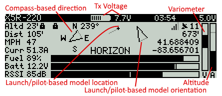

# Lua Telemetry Flight Status for INAV/Taranis - v1.3.1

```
SmartPort(S.Port), F.Port and D-series telemetry on Taranis QX7, X9D, X9D+ and X9E transmitters
```

## Screenshots

#### Taranis QX7


#### Taranis X9D, X9D+ and X9E


## Features

* SmartPort(S.Port), F.Port and FrSky D-series telemetry on Taranis QX7, X9D, X9D+ and X9E transmitters
* Launch/pilot-based model orientation and location indicators (great for lost orientation/losing sight of your model)
* Compass-based direction indicator (with compass on multirotor or fixed-wing with GPS)
* Bar gauges for Fuel (% battery mAh capacity remaining), Battery voltage, RSSI strength, Transmitter battery, Variometer (and Altitude for X9D, X9D+ and X9E transmitters)
* Display and voice alerts for flight modes and flight mode modifiers (altitude hold, heading hold, home reset, etc.)
* Voice notifications for % battery remaining (based on current), voltage low/critical, high altitude, lost GPS, ready to arm, armed, disarmed, etc.
* GPS info: Satellites locked, GPS altitude, GPS coordinates. Also logs the last 5 GPS coordinates (reviewed from the config menu)
* Display of current/maximum: Altitude, Distance, Speed and Current
* Display of current/minimum: Battery voltage, RSSI strength
* Title display of model name, flight timer, transmitter voltage and receiver voltage
* Menu configuration options can be changed from inside the script
* Speed and distance values are displayed in metric or imperial based on transmitter's telemetry settings

## Requirements

* [OpenTX v2.2.0+](http://www.open-tx.org/) running on Taranis QX7, X9D, X9D+ or X9E
* FkSky X-series or D-series telemetry receiver: X4RSB, X8R, XSR, R-XSR, XSR-M, XSR-E, D8R-II plus, D8R-XP, D4R-II, etc.
* [INAV v1.7.3+](https://github.com/iNavFlight/inav/releases) running on your flight controller
* GPS - If you're looking for a GPS module, I suggest the [Beitian BN-880](https://www.banggood.com/UBLOX-NEO-M8N-BN-880-Flight-Control-GPS-Module-Dual-Module-Compass-p-971082.html)

#### Suggested Sensors

* Altimeter/barometer (GPS altitude used if barometer not present)
* Magnetometer/compass (fixed-wing craft use GPS for some directional info)
* Current/amperage (for fuel gauge)

## Notes

* INAV v2.0+ is required for FkSky D-series telemetry compatibility
* INAV v1.9.1+ is required for F.Port compatibility
* INAV v1.8+ is required for `Home reset` voice notification
* Crossfire is **NOT** supported due to missing telemetry data required by Lua Telemetry
	* Lua Telemetry can't fix this, Crossfire has missing flight mode info Lua Telemetry requires

## Setup

#### In INAV Configurator

1. Setup SmartPort(S.Port), F.Port or D-series telemetry to send to your transmitter - [INAV telemetry docs](https://github.com/iNavFlight/inav/blob/master/docs/Telemetry.md)
1. If you have an current sensor, in CLI settings set `battery_capacity` to the mAh you want to draw from your battery
	* If running INAV v1.9.0+: `set smartport_fuel_unit = PERCENT` in CLI settings
	* If running INAV previous to v1.9.0: `set smartport_fuel_percent = ON` in CLI settings

#### From Transmitter

1. With battery connected and **after GPS fix** [discover telemetry sensors](https://www.youtube.com/watch?v=n09q26Gh858) so all telemetry sensors are discovered
1. Telemetry distance sensor name `0420` (or `0007` with D-series receivers) should be changed to `Dist` and set to the desired unit: `m` or `ft`
1. The sensors `Dist`, `Alt`, `GAlt` and `Gspd` can be changed to the desired unit: `m` or `ft` / `kmh` or `mph`
1. **Don't** change `Tmp1` or `Tmp2` from Celsius to Fahrenheit! They're not temps (used for flight modes and GPS info)

#### INAV Lua Telemetry Screen Setup

1. Download the latest [Lua Telemetry ZIP file](https://github.com/iNavFlight/LuaTelemetry/releases/latest)
1. From the downloaded ZIP file, copy the contents of the `TELEMETRY` folder (both the `iNav.lua` file and `iNav` folder) to the transmitter's SD card's `\SCRIPTS\TELEMETRY\` folder
1. In model setup, page to `DISPLAY`, set desired screen to `Script` and select `iNav`

## Usage

#### Screen Description



* From transmitter's main screen, long hold the `Page` button to show custom screens, short press `Page` to the iNav screen
* If you get a `Script panic not enough memory` error when starting Lua Telemetry, please see the [Tips](#tips) section
* Flashing values indicate a warning (for example: no telemetry, battery low, altitude too high)
* When not armed you can flip between max/min and current values by using the dial or +/- buttons
* To flip between compass-based direction and launch/pilot-based orientation and location, use the dial
* The launch/pilot-based orientation view is useful if model orientation is unknown
* If model is further than 25 feet away, the launch/pilot-based view will show the direction of the model based on launch/pilot position and orientation (useful to locate a lost model)
* The script gives voice feedback for flight modes, battery levels and warnings (no need to manually set this up)
* Voice alerts will play in background even if iNav Lua Telemetry screen is not displayed

#### Configuration Settings
Press the `Menu` button to display the configuration options menu:

* Use the dial or +/- buttons to cycle through the menu or select the desired setting
* Press Enter/dial to select and deselect a menu option
* Press `Exit` to deselect a menu option or escape the configuration menu


* **Battery View** - Total battery voltage / Cell voltage average (default: Total)
* **Battery Alert** - Battery alerts on, off or only critical alerts (default: On)
* **Cell Low** - Cell voltage for low battery warning (default: 3.5V)
* **Cell Critical** - Cell voltage for battery critical warning (default: 3.4V)
* **Fuel Critical** - Fuel percentage for battery critical warning (default: 20%)
* **Altitude Alert** - Turn on or off the altitude alert (default: On)
* **Max Altitude** - Altitude warning starts when over this value (default: 400ft or 120m)
* **Timer** - Show the automatic flight timer, timer1-3 or turn timer off (default: Auto)
* **Rx Voltage** - Turn on or off the receiver voltage in the title (default: On)
* **Variometer** - Show if model is gaining or decreasing altitude (default: On)
* **Voice Alerts** - Voice alerts on, off or only critical alerts (default: On)
* **Feedback** - Turn beeper and/or haptic feedback for alerts on or off (default: On)
* **RTH Feedback** - Return to home beeper and haptic feedback on or off (default: On)
* **HF Feedback** - Head free beeper and haptic feedback on or off (default: On)
* **RSSI Feedback** - RSSI beeper and haptic feedback on or off (default: On)
* **GPS Coords** - GPS coords as decimal, degrees/minutes or geocoding format (default: Decimal)
* **GPS** - Not a configuration option, shows a log of the last 5 GPS coordinates

## Tips

> **Script panic not enough memory error:**
> Be sure you're following the [INAV Lua Telemetry Screen Setup](#inav-lua-telemetry-screen-setup) instructions.
> If you're still having memory issues, you can free up memory by turning off OpenTX firmware build options and/or removing other Lua Scripts from screens.
> Keep in mind that a not enough memory error doesn't indicate a problem with Lua Telemetry, it means exactly what it says, your transmitter is out of memory and therefore can't run Lua Telemetry.

* Between flights (before armed), long-press Enter/dial and select `Reset telemetry` to reset telemetry values
* If current sensor isn't present or _battery isn't fully charged when plugged in_, fuel gauge will be based on battery voltage
* If fuel gauge isn't accurate, be sure you've set CLI values `smartport_fuel_unit` and `battery_capacity` correctly. Also, current sensor settings in the configurator need to be calibrated for proper amperage and fuel % data
* Uses transmitter settings for RSSI warning/critical levels for bar gauge range and audio/haptic warnings
* Uses transmitter settings for transmitter voltage min/max for battery bar gauge in screen title
* If you change a telemetry sensor's unit (for example m to ft), power cycle the transmitter to see changes

## Support

When opening an issue, please use the form outline as a guide for easier reproduction, diagnosis and a faster resolution

* [All issues](https://github.com/iNavFlight/LuaTelemetry/issues?q=is%3Aissue)
* [Open issues](https://github.com/iNavFlight/LuaTelemetry/issues)

## Change Log

* [Release history](CHANGES.md)

## License

* [MIT license](LICENSE)
