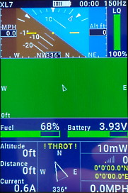

## INAV Lua Telemetry Flight Status for Taranis/Horus/Jumper/Nirvana - v1.7.5

> The new home for Lua Telemetry:
> 
> **https://github.com/teckel12/LuaTelemetry**

### FrSky SmartPort(S.Port), D-series, F.Port & TBS Crossfire telemetry on Taranis, Horus, Jumper & Nirvana transmitters

## Interface

#### [Video of Lua Telemetry running on X9D+](https://youtu.be/YaUgywuT1YM)

#### Horus/Jumper T16 and Nirvana view

&nbsp;&nbsp;

#### Pilot (glass cockpit) view for fixed wing pilots

&nbsp;&nbsp;

#### Radar (map) view

&nbsp;&nbsp;

#### Altitude graph view

&nbsp;&nbsp;

#### Classic view

&nbsp;&nbsp;

## Features

* Supported receivers: All FrSky telemetry receivers (X, R9 and D series) and all TBS Crossfire receivers
* Supported transmitters: All FrSky Taranis and Horus transmitters, Jumper T12 & T16 and the FLYSKY Nirvana NV14
* Compatible with Betaflight using FrSky X or R9 series receivers (with reduced functionality) and TBS Crossfire support
* Launch/pilot-based model orientation and location indicators (great for lost orientation/losing sight of your model)
* Compass-based direction indicator (with magnetometer sensor on multirotor or fixed-wing with GPS)
* Pilot (glass cockpit) view which includes attitude indicator as well as pilot-familiar layout of additional data
* Radar (map) view shows model in relationship to home position, can be displayed either as launch/pilot-based or compass-based orientation
* Altitude graph view shows altitude for the last 1-6 minutes
* Horus, Jumper T16 & FLYSKY Nirvana NV14 transmitters show all views at the same time, and include additional features like roll scale
* Bar gauges for Fuel (% battery mAh capacity remaining), Battery voltage, RSSI strength, Transmitter battery, GPS accuracy (HDOP), Variometer (and Altitude for X9D, X9D+ and X9E transmitters)
* Display and voice alerts for flight modes and flight mode modifiers (altitude hold, heading hold, home reset, etc.)
* Voice notifications for % battery remaining (based on current), voltage low/critical, high altitude, lost GPS, ready to arm, armed, disarmed, etc.
* GPS info: Satellites locked, GPS accuracy (HDOP), GPS altitude, GPS coordinates. Also logs the last GPS location (reviewed from the config menu)
* Playback previous flights via telemetry log files, including fast forward, rewind, and pause features
* Display of current/maximum: Altitude, Distance, Speed and Current
* Display of current/minimum: Battery voltage, RSSI strength
* Title display of model name, flight timer, transmitter voltage and receiver voltage
* Menu configuration options can be changed from inside the script and can be unique to each model
* Speed and distance values are displayed in metric or imperial based on transmitter's telemetry settings
* Voice files, modes and config menu in English, German, French or Spanish (more languages to follow)

## Requirements

* [INAV v2.1.0+](https://github.com/iNavFlight/inav/releases) running on your flight controller - Also compatible with Betaflight v4.0.0+ (with reduced functionality)
* [OpenTX v2.2.3+](http://www.open-tx.org/) running on Taranis Q X7/Q X7S, X9D/X9D+, X9E, X9 Lite, X-Lite/X-Lite Pro, Horus X10/X10S or X12S
* Jumper T12/T16 requires [JumperTX 2.2.3+](https://www.jumper.xyz/) (May 23, 2019 or after release)
* FrSky X, R9 or D series telemetry receiver: X4RSB, X8R, XSR, R-XSR, XSR-M, XSR-E, RX4R, RX6R, R9, R9 Slim, R9 Slim+, R9 Mini, R9 MM, D8R-II plus, D8R-XP, D4R-II, etc. or any TBS Crossfire receiver: Micro, Nano, Diversity, etc.
* GPS - If you're looking for a GPS module, I suggest the [Beitian BN-880](https://us.banggood.com/custlink/vvGD6DZWyg)

## Suggested Sensors

* Altimeter/barometer (GPS altitude used if barometer not present)
* Magnetometer/compass for multi-rotor (fixed-wing craft use GPS for directional info)
* Current/amperage (for fuel gauge)

## Notes

* Some telemetry is missing from Crossfire: HDOP, GPS altitude and some secondary flight mode notifications like heading hold
* Betaflight v4.0.0+ mostly works, except for some GPS and flight mode information which is missing from Betaflight
* Use the OSD to control VTx band, frequency and power (except for on 2019 series Taranis transmitters, Betaflight's lua script can't run at the same time as INAV Lua Telemetry due to limited transmitter memory)

## Special Thanks

* [Team Black Sheep](https://www.team-blacksheep.com/) - Sponsoring TBS Crossfire telemetry support
* [FrSky](https://www.frsky-rc.com/) - Sponsoring FrSky Horus transmitter support
* [Jumper](https://www.jumper.xyz/) - Sponsoring Jumper T16 transmitter support
* [FLYSKY](https://www.flysky-cn.com/) - Sponsoring FLYSKY Nirvana NV14 transmitter support

## Setup

* [Lua Telemetry Wiki](https://github.com/teckel12/LuaTelemetry/wiki)
* [Download latest release](https://github.com/teckel12/LuaTelemetry/releases/latest)
* [Installation Instructions](https://github.com/teckel12/LuaTelemetry/wiki/Installation)
* [Upgrade Instructions](https://github.com/teckel12/LuaTelemetry/wiki/Upgrade)
* [Download Options](https://github.com/teckel12/LuaTelemetry/wiki/Download-Options)

## Information & Settings

* [Screen Description](https://github.com/teckel12/LuaTelemetry/wiki/Screen-Description)
* [Configuration Settings](https://github.com/teckel12/LuaTelemetry/wiki/Configuration-Settings)
* [Suggested Battery Settings](https://github.com/teckel12/LuaTelemetry/wiki/Suggested-Battery-Settings)
* [Playback Telemetry Logs](https://github.com/teckel12/LuaTelemetry/wiki/Playback-Telemetry-Log-Files)

## Support

* [Tips & Common Problems](https://github.com/teckel12/LuaTelemetry/wiki/Tips-&-Common-Problems)
* [Support Issues](https://github.com/teckel12/LuaTelemetry/issues?q=is%3Aissue)
* [Support Chat (Telegram)](https://t.me/luatelemetry)

## Other

* [Upgrade to Development Build](https://github.com/teckel12/LuaTelemetry/wiki/Upgrade-to-Development-Build)
* [Release History](https://github.com/teckel12/LuaTelemetry/wiki/Change-Log)
* [Multilingual Support](https://github.com/teckel12/LuaTelemetry/wiki/Multilingual-Support)
* [License](https://github.com/teckel12/LuaTelemetry/blob/master/LICENSE)
