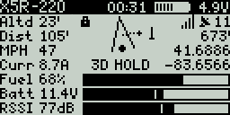
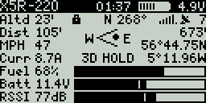
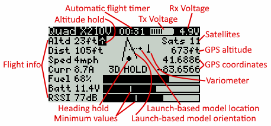
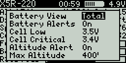

# SmartPort/INAV Telemetry Flight Status - v1.2.0

#### Taranis Q X7

#### Taranis X9D, X9D Plus & X9E

## Features

* Launch/pilot-based model orientation and location indicators (great for lost orientation/losing sight of your model)
* Compass-based direction indicator (with compass on multirotor or fixed wing with GPS)
* Bar gauges for Fuel (% battery mAh capacity remaining), Battery voltage, RSSI strength, Transmitter battery (and Altitude for X9D, X9D Plus & X9E transmitters)
* Display and voice alerts for flight modes and flight mode modifiers (altitude hold, heading hold, home reset, etc.)
* Voice notifications for % battery remaining (based on current), voltage low/critical, high altitude, lost GPS, ready to arm, armed, disarmed, etc.
* GPS information: Satellites locked, GPS altitude, GPS coordinates
* Display of current/maximum: Altitude, Distance, Speed and Current
* Display of current/minimum: Battery voltage, RSSI strength
* Display of current Fuel (% battery mAh capacity remaining), Receiver voltage and flight timer
* Speed and distance values are displayed in metric or imperial based on transmitter's telemetry settings

## Requirements

* [OpenTX v2.2.0+](http://www.open-tx.org/) (**`luac` build option required!**) running on Taranis Q X7, X9D, X9D Plus or X9E
* SmartPort telemetry compatible receiver: X4R(SB), X8R, XSR, R-XSR, XSR-M, XSR-E, etc. (*NOT* D-series receivers)
* [INAV v1.7.3+](https://github.com/iNavFlight/inav/releases) running on your flight controller
* GPS (suggested but not required: altimeter (barometer), magnetometer (compass) and current sensors

> Note: This Lua Telemetry script **requires** SmartPort telemetry as noted above.
> Lua Telemetry **won't work with Crossfire** for example because it uses proprietary sensor names/formatting and missing sensor information that Lua Telemetry needs.

## Setup

#### In INAV Configurator

1. Setup SmartPort telemetry to send to your transmitter - [INAV telemetry docs](https://github.com/iNavFlight/inav/blob/master/docs/Telemetry.md#smartport-sport-telemetry)
2. If you have an amperage sensor (which I highly suggest), configure `battery_capacity` to the mAh you want to draw from your battery and set `smartport_fuel_percent = ON` in CLI settings (allows proper calibration of fuel used percentage)

#### From Transmitter

1. With battery connected and **after GPS fix** [discover telemetry sensors](https://www.youtube.com/watch?v=n09q26Gh858) so all telemetry sensors are discovered
2. Telemetry distance sensor name **must** be changed from `0420` to `Dist` and set to the desired unit: `m` or `ft`
3. The sensors `Dist`, `Alt`, `GAlt` & `Gspd` can be changed to the desired unit: `m` or `ft` / `kmh` or `mph`
4. **Don't** change `Tmp1` or `Tmp2` from Celsius to Fahrenheit! They're not really temperatures but used for flight modes and GPS information

#### INAV Lua Telemetry Screen Setup

1. Download the [Lua Telemetry ZIP file](https://github.com/iNavFlight/LuaTelemetry/archive/master.zip)
2. From the downloaded ZIP file, copy the contents of the `TELEMETRY` folder to the transmitter's SD card's `\SCRIPTS\TELEMETRY\` folder
3. In model setup, page to `DISPLAY`, set desired screen to `Script`, and select `iNav`

## Usage

#### Screen Description

* From transmitter's main screen, hold the `Page` button to show custom screens, page to the iNav screen
* Flashing values indicate a warning (for example: no telemetry, battery low, altitude too high)
* To flip between max/min and current values, use the dial or +/- buttons
* To flip between compass-based direction and launch/pilot-based orientation and location, use the dial or +/- buttons
* The launch/pilot-based orientation view is useful if model orientation is unknown
* If model is further than 25 feet away, the launch/pilot-based view will show the direction of the model based upon launch/pilot position and orientation (useful to locate a lost model)
* The script gives voice feedback for flight modes, battery levels, and warnings (no need to manually set this up)
* Voice alerts will play in background even if iNav Lua Telemetry screen is not displayed

#### User Setting
Press the `Menu` button (when not armed) to display the configuration options menu:

* **Battery View** - Total battery voltage / Cell voltage average (default: Total)
* **Cell Low** - Cell voltage for low battery warning (default: 3.5v)
* **Cell Critical** - Cell volgate for battery critical warning (default: 3.4v)
* **Max Altitude** - Altitude where altitude warning starts (default: 400ft or 123m)
* **Voice Alerts** - Turn on or off all voice alerts (default: On)
* **10% mAh Alerts** - Voice alerts for each 10% fuel (with current sensor) (default: On)

## Tips & Notes

* If the script doesn't run or you get a memory error, enable the `luac` build option in your OpenTX firmware
* Between flights (before armed), long-press the Enter/dial and select `Reset telemetry` to reset telemetry values
* Optional (but highly suggested) current sensor needed for fuel and current displays
* Uses transmitter settings for RSSI warning/critical levels for bar gauge range and audio/haptic warnings
* Uses transmitter settings for transmitter voltage min/max for battery bar gauge in screen title
* If you're not getting model distance data, change your telemetry distance sensor name from `0420` to `Dist`
* If you change a telemetry sensor's unit, you'll need to power cycle the transmitter for the change to take effect
* INAV v1.8+ is required for `Home reset` voice notification

## Release History

#### v1.2.0
* Lua Telemetry is now pre-compiled to greatly reduce memory (source still available)
* Press `Menu` button (when not armed) to modify user configuration options
* Fixed `FAILSAFE`, `RTH`, `NOT OK` & `NO TELEM` modes to flash as they should
* Barometer and magnetometer are now optional (but suggested for full functionality)
* Headfree indication on Q X7 changed to show directional indicators as dotted lines
* Startup message/version and error if not running OpenTX v2.2.0 or later
#### v1.1.7
* Fix for the default unit type of the `Dist` (`0420`) sensor
#### v1.1.6
* On home reset, reset GPS home position, orientation and distance
* Option to display average battery cell voltage instead of total voltage
* Extra digit for data on X9D & X9D Plus transmitters
* Variable cleanup saving memory
#### v1.1.5 - 10/20/2017
* Voice notification for `Home Reset` with INAV v1.8+
* Moved head free warning on Q X7 to top center
* Values convert from decimal to integer when larger to allow for more room
* Better text centering and right justification technique
* Cleaned up code saving more memory
#### v1.1.4 - 10/13/2017
* More accurate max altitude alerts and altitude flashes when above max altitude
* Long-press <Enter> resets values (suggest doing this between flights before armed)
#### v1.1.3 - 10/10/2017
* Shows metric or imperial values based on transmitter telemetry settings
#### v1.1.2 - 10/06/2017
* Lots of refactoring which greatly reduced memory usage
* Re-enabled altitude bar gauge for X9D, X9D Plus & X9E transmitters
* Better information layout if no current sensor is present
* Refactored GPS lock calculation to prevent script syntax errors
#### v1.1.1 - 09/28/2017
* Refactored code to reduce memory
* Removed altitude bar gauge for X9D, X9D Plus & X9E transmitters (used too much memory?)
#### v1.1.0 - 09/22/2017
* Repo moved to INAVFlight
* Screen formatting for Taranis X9D, X9D Plus & X9E
#### v1.0.0 - 09/19/2017
* Initial release

## License

[MIT](https://github.com/iNavFlight/LuaTelemetry/blob/master/LICENSE)