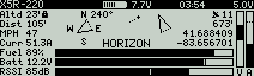
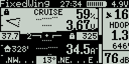
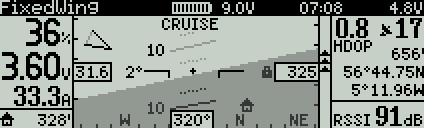
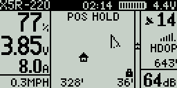
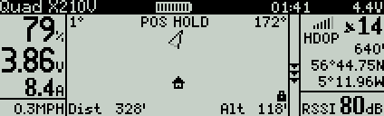
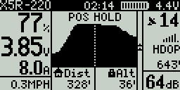
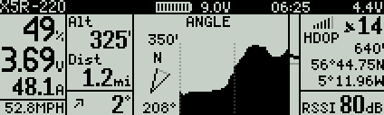
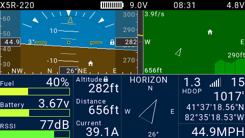

## INAV Lua Telemetry Flight Status for Taranis/Horus/Jumper T16 - v1.7.1

### FrSky SmartPort(S.Port), D-series, F.Port & TBS Crossfire telemetry on Taranis, Horus & Jumper T16 transmitters

## Interface

#### [Video of Lua Telemetry](https://youtu.be/YaUgywuT1YM)

#### Classic view

&nbsp;&nbsp;

#### Pilot (glass cockpit) view for fixed wing pilots

&nbsp;&nbsp;

#### Radar (map) view

&nbsp;&nbsp;

#### Altitude graph view

&nbsp;&nbsp;

#### Horus/Jumper T16 view

## Features

* Works with all FrSky telemetry receivers (X, R9 and D series), all TBS Crossfire receivers, all FrSky Taranis and Horus transmitters, and the Jumper T16 transmitter
* Compatible with Betaflight using FrSky X or R9 series receivers (with reduced functionality) and TBS Crossfire support with Betaflight 4.0.0+
* Launch/pilot-based model orientation and location indicators (great for lost orientation/losing sight of your model)
* Compass-based direction indicator (with magnetometer sensor on multirotor or fixed-wing with GPS)
* Pilot (glass cockpit) view which includes attitude indicator as well as pilot-familiar layout of additional data
* Radar (map) view shows model in relationship to home position, can be displayed either as launch/pilot-based or compass-based orientation
* Altitude graph view shows altitude for the last 1-6 minutes
* Horus and Jumper T16 transmitters show all views at the same time, and include additional features like roll scale
* Bar gauges for Fuel (% battery mAh capacity remaining), Battery voltage, RSSI strength, Transmitter battery, GPS accuracy (HDOP), Variometer (and Altitude for X9D, X9D+ and X9E transmitters)
* Display and voice alerts for flight modes and flight mode modifiers (altitude hold, heading hold, home reset, etc.)
* Voice notifications for % battery remaining (based on current), voltage low/critical, high altitude, lost GPS, ready to arm, armed, disarmed, etc.
* GPS info: Satellites locked, GPS accuracy (HDOP), GPS altitude, GPS coordinates. Also logs the last GPS location (reviewed from the config menu)
* Display of current/maximum: Altitude, Distance, Speed and Current
* Display of current/minimum: Battery voltage, RSSI strength
* Title display of model name, flight timer, transmitter voltage and receiver voltage
* Menu configuration options can be changed from inside the script and can be unique to each model
* Speed and distance values are displayed in metric or imperial based on transmitter's telemetry settings
* Voice files, modes and config menu in English, German, French or Spanish (more languages to follow)

## Requirements

* [OpenTX v2.2.2+](http://www.open-tx.org/) running on Taranis Q X7/Q X7S, X9D/X9D+, X9E, X9 Lite, X-Lite/X-Lite Pro, Horus X10/X10S or X12S (OpenTX v2.2.3+ is suggested)
* Jumper T16 requires [JumperTX 2.2.3+](https://www.jumper.xyz/jumpertx-t16) (May 23, 2019 or after release)
* FrSky X, R9 or D series telemetry receiver: X4RSB, X8R, XSR, R-XSR, XSR-M, XSR-E, RX4R, RX6R, XM, XM+, R9, R9 Slim, R9 Slim+, R9 Mini, R9 MM, D8R-II plus, D8R-XP, D4R-II, etc. or any TBS Crossfire receiver: Micro, Nano, Diversity, etc.
* [INAV v1.7.3+](https://github.com/iNavFlight/inav/releases) running on your flight controller (INAV v2.1.0+ is suggested for full functionality) - Also compatible with Betaflight (with reduced functionality)
* GPS - If you're looking for a GPS module, I suggest the [Beitian BN-880](https://www.banggood.com/UBLOX-NEO-M8N-BN-880-Flight-Control-GPS-Module-Dual-Module-Compass-p-971082.html)

## Suggested Sensors

* Altimeter/barometer (GPS altitude used if barometer not present)
* Magnetometer/compass for multi-rotor (fixed-wing craft use GPS for directional info)
* Current/amperage (for fuel gauge)

## Notes

* INAV v2.1.0+ is required for TBS Crossfire support (some telemetry missing from Crossfire: HDOP, GPS altitude, variometer and heading hold notifications)
* INAV v2.0.0+ is required for FrSky D-series telemetry and proper GPS accuracy (HDOP) display
* If using pilot or radar view or a Horus transmitter and INAV v2.0+, set `frsky_pitch_roll = ON` in CLI settings for more accurate attitude display
* INAV v1.9.1+ is required for F.Port compatibility
* INAV v1.8.0+ is required for `Home reset` voice notification
* OpenTX v2.2.2 (release version) is required for compatibility with Taranis X-Lite transmitter and Crossfire telemetry
* Betaflight compatibility is mostly complete, except for some GPS and flight mode information missing from Betaflight
* Use the OSD to control VTx band, frequency and power (Betaflight lua script can't be run at the same time as INAV Lua Telemetry due to limited transmitter memory)

## Special Thanks

* [Team Black Sheep](https://www.team-blacksheep.com/) - Sponsoring TBS Crossfire telemetry support
* [FrSky](https://www.frsky-rc.com/) - Sponsoring Horus transmitter support
* [Jumper](https://www.jumper.xyz/) - Sponsoring Jumper T16 transmitter support

## Setup

* [Lua Telemetry Wiki](https://github.com/iNavFlight/LuaTelemetry/wiki)
* [Download latest release](https://github.com/iNavFlight/LuaTelemetry/releases/latest)
* [Installation Instructions](https://github.com/iNavFlight/LuaTelemetry/wiki/Installation)
* [Upgrade Instructions](https://github.com/iNavFlight/LuaTelemetry/wiki/Upgrade)
* [Download Options](https://github.com/iNavFlight/LuaTelemetry/wiki/Download-Options)

## Information & Settings

* [Screen Description](https://github.com/iNavFlight/LuaTelemetry/wiki/Screen-Description)
* [Configuration Settings](https://github.com/iNavFlight/LuaTelemetry/wiki/Configuration-Settings)
* [Suggested Battery Settings](https://github.com/iNavFlight/LuaTelemetry/wiki/Suggested-Battery-Settings)
* [Change Log - Release History](https://github.com/iNavFlight/LuaTelemetry/wiki/Change-Log)

## Support

* [Tips & Common Problems](https://github.com/iNavFlight/LuaTelemetry/wiki/Tips-&-Common-Problems)
* [Support Issues](https://github.com/iNavFlight/LuaTelemetry/issues?q=is%3Aissue)
* [Support Chat (Telegram)](https://t.me/luatelemetry)

## Other

* [Upgrade to Development Build](https://github.com/iNavFlight/LuaTelemetry/wiki/Upgrade-to-Development-Build)
* [Multilingual Support](https://github.com/iNavFlight/LuaTelemetry/wiki/Multilingual-Support)
* [License](https://github.com/iNavFlight/LuaTelemetry/blob/master/LICENSE)
